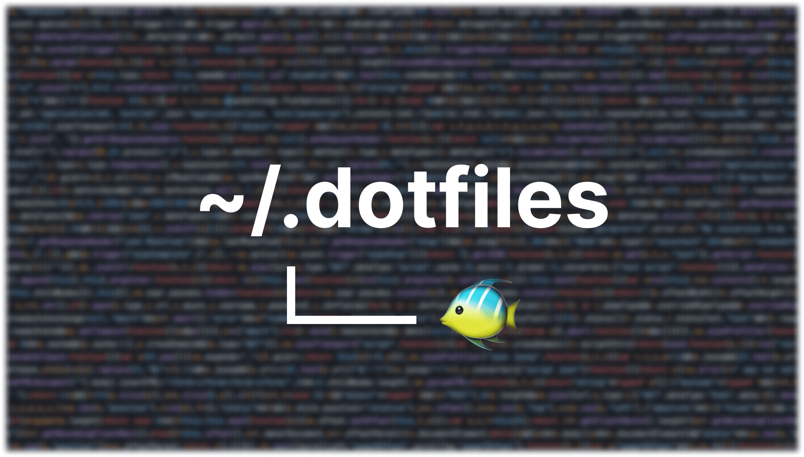

<!-- markdownlint-configure-file { "no-inline-html": { "allowed_elements": [h1, img, details, summary] } } -->

<h1 align="center"></h1>

## Get Started :rocket:

```sh
bash -c "$(curl -fsSL https://github.com/KaBankz/dotfiles/raw/dotter/setup.sh)"
```

## Key Features :key:

:tropical_fish: **Fish Shell** — I use the [Fish Shell](https://fishshell.com/) as my default shell, with a heavily customized config following fish best practices.

- I documented most of my findings in my [fish README](./fish/README.md).
- _I've spent WAY too much time configuring fish_ :sweat_smile:

:house: **XDG Base Directory** — I follow the [XDG Base Directory Specification](https://specifications.freedesktop.org/basedir-spec/basedir-spec-latest.html) for my dotfiles.

- I have gone through great lengths to ensure that all my dotfiles are not scattered throughout my home directory. (Check fish env vars)

:beer: **Homebrew** — I use [Homebrew](https://brew.sh/) to manage my packages on macOS.

- I have a Brewfile that contains all the packages I use.

:package: **Dotter** — I use [Dotter](https://github.com/SuperCuber/dotter) to manage my dotfiles.

- I have tried _MANY_ dotfile managers, and Dotter is the one that I like the most.

## Manual Installation :hammer_and_wrench:

<details>

<summary>Click to expand</summary>

1. Clone this repo

    ```sh
   git clone https://github.com/KaBankz/dotfiles.git ~/.dotfiles
    ```

2. Go to the repo and stay there until the end

    ```sh
    cd ~/.dotfiles
    ```

    > **IMPORTANT:**
    > You must create a `local.toml` file inside the `.dotter` directory.
    >
    > This file is used to store your local configurations.
    >
    > You can copy the `macos.toml` or any host config file from `.dotter` and modify it to your needs.

    ```sh
    cp .dotter/macos.toml .dotter/local.toml
    ```

3. Download the `dotter` binary inside the repo

    > **WARNING:**
    > Be sure to download the appropriate binary for your os and arch from [Dotter Releases](https://github.com/SuperCuber/dotter/releases/latest#:~:text=Assets).

    ```sh
    curl -fsSL -o dotter https://github.com/SuperCuber/dotter/releases/latest/download/dotter-macos-arm64.arm
    chmod +x dotter
    ```

4. Run `dotter deploy` inside the repo

    The `-v` flag is optional, it enables verbose output to see what is happening.

    > **CAUTION:**
    > If you have any existing dotfiles that conflict with the ones in this repo, you will receive an error. You can either remove the conflicting dotfiles or overwrite them using `--force`.

    ```sh
    ./dotter deploy -v
    ```

</details>

## License :scroll:

[MIT](LICENSE)
