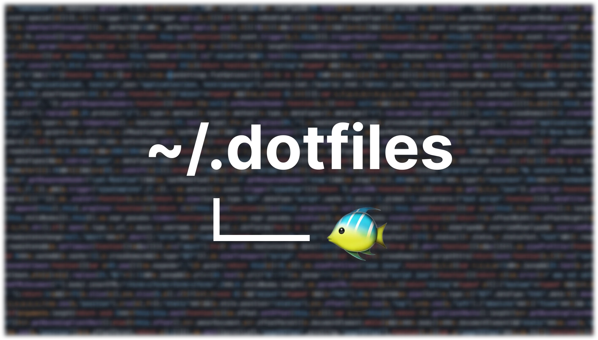

<!-- markdownlint-configure-file { "no-inline-html": { "allowed_elements": [h1, img, details, summary] } } -->

<h1 align="center"></h1>

## Get Started :rocket:

```sh
bash -c "$(curl -fsSL https://krabby.dev/setup)"
```

> [!TIP]
> You can use the `-y` flag to auto-confirm all prompts.

<!--  -->

> Script Source Code: [setup.sh](./setup.sh)

## Key Features :key:

:tropical_fish: **Fish Shell** — I use the [Fish Shell](https://fishshell.com/) as my default shell, with a heavily customized config following fish best practices.

- I documented most of my findings in my [fish README](./fish/README.md).
- _I've spent WAY too much time configuring fish_ :sweat_smile:

:house: **XDG Base Directory** — I follow the [XDG Base Directory Specification](https://specifications.freedesktop.org/basedir-spec/basedir-spec-latest.html) for my dotfiles.

- I have gone through great lengths to ensure that all my dotfiles are not scattered throughout my home directory. (Check fish env vars)

:beer: **Homebrew** — I use [Homebrew](https://brew.sh/) to manage my packages on macOS.

- I have a Brewfile that contains all the packages I use.

:package: **Dotter** — I use [Dotter](https://github.com/SuperCuber/dotter) to manage my dotfiles.

- I have tried _MANY_ dotfile managers, and Dotter is the one that I like the most.

## License :scroll:

[MIT](LICENSE)
